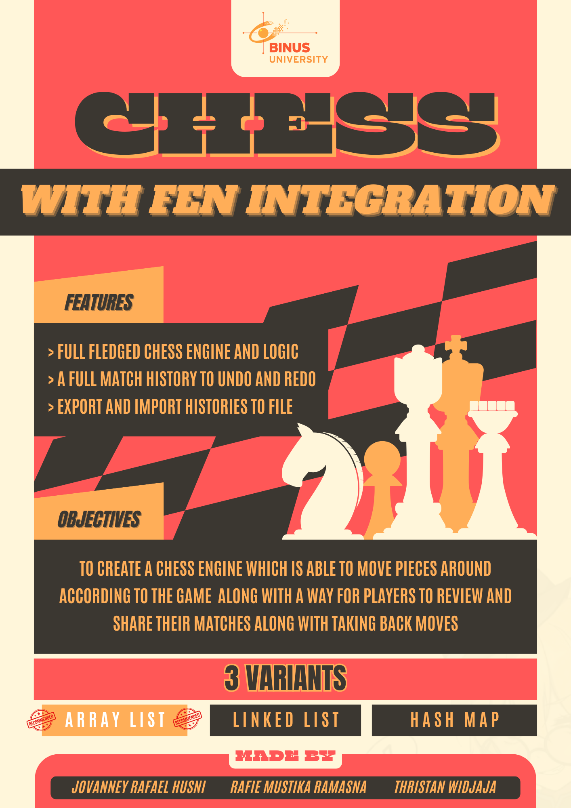

# Chess Engine with FEN Integration

FEN or Forsyth-Edwards Notation is a common notation used in computer to tell the position of a given chess game at any moment, from the pieces in each rank, the current turn, the possibility of castling, En Passant squares. 

Such a notation can be chained together to do a multitude of things to help you understand your games better, particularly when it comes to reviewing your game after a match has ended! Which is exactly what our app allows you to do!

## Features
- Moving back and forth the match
- Redo / retake moves you didn't mean to
- Export and import Match History
- 2 Player, turn-based, good ol' fashioned Chess

## Installation
> **Keep in mind that you will need the LATEST JAVA VERSION to run the .exe or .java**

### Running through Windows
1. You can install the game either by directly downloading the ZIP of the **source code** and navigating to one of the folders (Array List, Linked List, Hash Map, choose whichever one) or by going to the releases and downloading the exe directly.
2. Then clicking directly onto one of the folders allows you to find a **exe** file.
3. Double clicking this **exe** file (note that this only works for Windows Operating Systems **only**)
4. Have fun!

### Running through other OS
1. Install the **source code**.
2. Navigate into one of the variants and into the **src** folder.
3. Open the *ChessApplication.java* in a suitable Java IDE before running it there!

